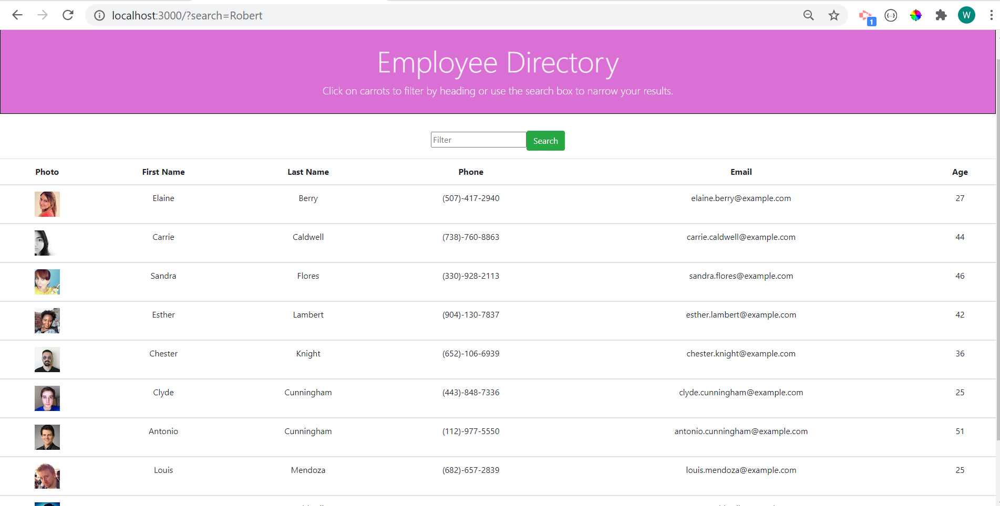

# react-employee-directory

## Table of Contents
<!--ts-->
   * [Project Description](#project-description)
   * [Technologies Used](#technologies-used) 
   * [Dependencies](#dependencies)
   * [Tests](#tests)
   * [Using Repo](#using-repo)
   * [Contributing to the repo](#contributing-to-the-repo)
   * [Licenses](#licenses)
   * [Inquiries](#inquiries)
   * [Developer Info](#developer-info)
<!--te-->
## Project Description
A react app that displays an employee directory using an axios call and able to filter by name and sort by different fields

Project url: 
(https://github.com/wayele/react-employee-directory)

## Screenshots

## Technologies Used
React JS, Axios, Node JS, HTML, CSS, JavaScript

## Dependencies
npm install
## Tests
NA
## Using Repo
Enjoy
## Contributing to the repo
NA
## Licenses

MIT
## Inquiries
Yes

ayele.wub@gmail.com
## Developer Info:

Github username: wayele

Email: ayele.wub@gmail.com
